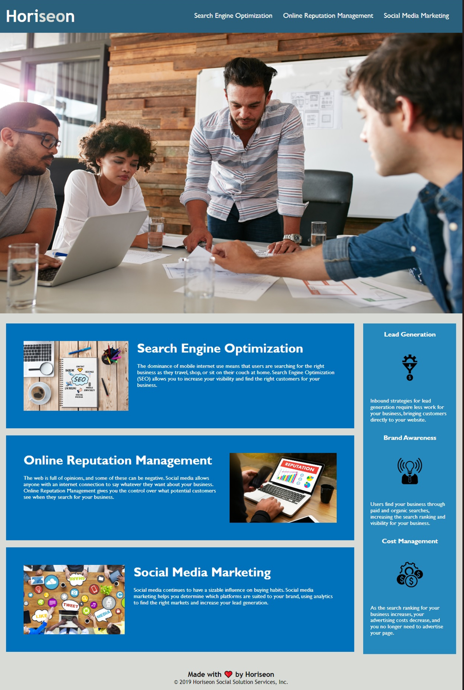

### Horiseon-accessibility

## Description

Code modification for bootcamp assignment to meet the accessibility criteria. There has been optimization to the website to aid with SEO, I have added and improved html elements to fit with semantic standards, all images have an alt tag now.

## Installation

Link to [github pages](https://wwww.dani57t.github.io/assingment1/).

Alternatively pull this repo

## Usage

Website uses top style nav bar 

## Credits

I followed tutorials on [w3 schools](https://www.w3schools.com/)

And myself!

## License 
MIT

DANI TAYLOR
